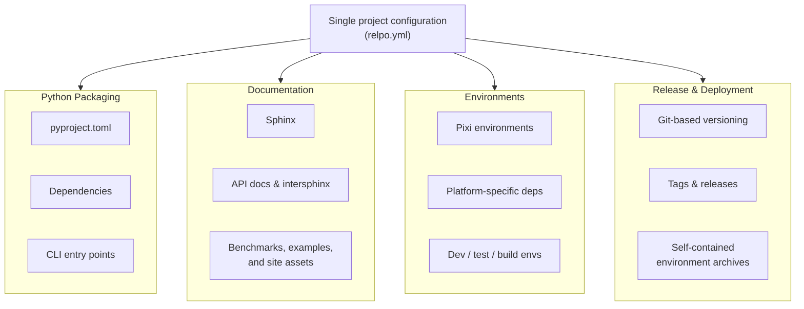

# Relpo: Single-Source Python Project Automation

[![PyPI][pypi-badge]][pypi-link]
[![Python 3.14][python314-badge]][python314-link]
[![Python 3.13][python313-badge]][python313-link]
[![Build Status][build-badge]][build-link]

Relpo is a configuration-driven project automation tool for Python.  It uses a
single `relpo.yml` project model to coordinate packaging, Python and Pixi
environments, documentation, Git-based versioning and releases, and deployable
environment archives.

The goal is simple: **describe the project once and derive the rest**.

Instead of independently maintaining overlapping project metadata across
`pyproject.toml`, Sphinx configuration, build scripts, release scripts, and
deployment tooling, Relpo keeps the common project information in one place and
generates the tool-specific configuration from it.



Relpo deliberately stays independent of the broader Zensols package stack, so
it can bootstrap projects without creating circular installation dependencies.
It delegates environment solving and packing to [Pixi] and [pixi-pack] rather
than implementing another package manager.

## Why Relpo?

A Python project commonly accumulates configuration across several systems:

| Configuration      | Purpose                            |
|--------------------|------------------------------------|
| `pyproject.toml`   | Packaging and dependencies         |
| Pixi configuration | Development and build environments |
| `docs/conf.py`     | Documentation                      |
| Release scripts    | Versions and Git tags              |
| Build scripts      | Project policy                     |
| Deployment scripts | Remote and offline installation    |


Much of that configuration describes the same project.  Relpo treats
`relpo.yml` as the project-level source of truth and uses established tools as
execution engines.

This provides two important benefits:

* **Single-source metadata:** project identity, Python versions, dependencies,
  documentation configuration, release policy, and deployment settings do not
  have to be synchronized manually across unrelated files.
* **Higher-level intent:** a project can declare that it has command-line entry
  points, documentation assets, platform-specific dependencies, or deployable
  environments and let Relpo generate the corresponding lower-level
  configuration.

## Features

* Generate `pyproject.toml` from declarative project configuration.
* Derive project versions from Git repository state instead of maintaining
  independent version strings throughout the source tree.
* Create, increment, and update Git tags.
* Validate changelog and Git tag versions for consistency.
* Configure Sphinx API documentation and dependent-project intersphinx
  inventories.
* Copy additional project content such as benchmark results, examples,
  configuration files, and other assets to generated documentation sites.
* Generate command-line entry-point configuration for projects that expose a
  CLI.
* Define Python/Pixi development, test, build, and platform-specific
  environments.
* Extend generated `pyproject.toml` content with arbitrary TOML tables when a
  project needs configuration outside Relpo's higher-level model.
* Render [Jinja2] templates using the same project configuration.
* Create self-contained environment distributions for remote or offline
  installation.
* Inject locally built wheels and other artifacts into environment
  distributions.
* Handle mixed Conda and PyPI environments where pip-installed artifacts must
  be treated separately during deployment.

## Documentation

See the [full documentation](https://plandes.github.io/relpo/index.html).
The [API reference](https://plandes.github.io/relpo/api.html) is also
available.

## Installation

Relpo is available from [PyPI]:

```bash
pip install zensols.relpo
```

Relpo works with [Pixi] for reproducible project environments and [pixi-pack]
for environment packaging.  It has no dependency on other Zensols Python
packages, which keeps the bootstrap path independent from the projects it
manages.

## Configuration

A `relpo.yml` file can describe considerably more than Python package metadata.
A minimal project configuration looks like:

```yaml
author:
  name: Jane Developer
  email: jane@example.com

github:
  user: janedev

project:
  domain: acme
  name: anvil
  short_description: Tools for building anvils.
  long_description: >-
    A Python toolkit for creating and deploying production-grade anvils.
  keywords:
    - anvil
    - manufacturing

  python:
    version:
      required: '>=3.12,<3.15'
      previous: '3.12.13'
      current: '3.13.12'
      package_host: '3.13.12'
    dependencies:
      - 'numpy~=2.4'
      - 'pandas~=3.0'
```

The same file can also describe project behavior that does not belong in the
standard Python project metadata model:

```yaml
project:
  has_entry_points: true

build:
  table_appends:
    tool.pixi.target.linux-64.pypi-dependencies:
      some-linux-package: '~=1.0'

doc:
  api_config:
    intersphinx_mapping:
      numpy:
        modules: ['numpy']
        url: 'https://numpy.org/doc/stable'
  copy:
    BENCHMARKS.md:
    examples:
    resources:

envdist:
  platforms: [linux-64]
```

Here, one project model describes Python package metadata, CLI behavior,
platform-specific dependencies, Sphinx integration, additional documentation
content, and deployment targets.

## Generated `pyproject.toml`

Relpo generates the standard `pyproject.toml` consumed by Python packaging and
Pixi tooling.  The generated file is a tool-facing representation of the
project model rather than a second independent source of project metadata.

Relpo can also express higher-level intent.  For example:

```yaml
project:
  has_entry_points: true
```

can be used by the project templates to generate the package entry-point
configuration.

For configuration Relpo does not model directly, arbitrary TOML content can be
appended:

```yaml
build:
  table_appends:
    tool.pixi.target.linux-64.pypi-dependencies:
      bitsandbytes: '~=0.49'
      xformers: '~=0.0.35'
```

This escape hatch keeps Relpo extensible without forcing its schema to mirror
every option supported by Pixi or `pyproject.toml`.

## Git-Based Versioning and Releases

Relpo uses Git repository state as the authority for project versions rather
than requiring version strings to be manually synchronized throughout the
project.

Release support includes:

* reading project versions from Git,
* creating and incrementing tags,
* updating release tags,
* checking changelog versions, and
* validating changelog/tag consistency.

This keeps release identity tied to repository state and allows generated
package metadata to use the same version source.

## Documentation

Relpo integrates Sphinx documentation into the same project configuration used
for packaging and building.

Projects can configure API documentation and dependent-project inventories:

```yaml
doc:
  api_config:
    intersphinx_mapping:
      numpy:
        modules: ['numpy']
        url: 'https://numpy.org/doc/stable'
```

Additional project content can be copied to the generated documentation site:

```yaml
doc:
  copy:
    BENCHMARKS.md:
    examples:
    trainconf:
```

This is useful for projects whose documentation includes benchmark results,
runnable examples, model configuration, or other repository artifacts in
addition to generated Python API pages.

## Self-Contained Environment Distribution

The `envdist` action creates a complete environment distribution for
installation on another machine, including systems with limited or no network
access.  This is useful for compute servers, HPC systems, controlled
environments, and other deployment targets where rebuilding a large Python
environment from the network is undesirable.

Configure the target environment in `relpo.yml`:

```yaml
envdist:
  cache_dir: ~/.cache/relpo
  pixi_lock_file: pixi.lock
  environment: build-env
  platforms:
    - linux-64
  injects:
    all:
      - pypi: target/dist/*.whl
```

Then create the distribution:

```bash
relpo envdist --config relpo.yml -o project-environment.tar
```

The resulting archive contains the artifacts needed to reconstruct the target
environment.  Relpo's environment distribution support complements
[pixi-pack], particularly for environments containing PyPI artifacts and local
build outputs.  Pip-installed packages can be handled separately when Conda
environment reconstruction cannot correctly consume archive dependencies.

Conceptually, this makes it possible to ship:

**One deployable environment archive** bundles:

- Python runtime
- Conda dependencies
- PyPI dependencies
- Locally built project artifacts

After transferring the archive to the target machine, run the generated
platform installer:

```bash
./<arch>-install.sh
```

### Source distributions requiring setuptools

Some source-distribution dependencies require `setuptools` or
`setuptools_scm` during installation.  A dedicated build environment can be
added through the generated Pixi tables:

```yaml
build:
  table_appends:
    tool.pixi.environments.build-env-add-setup:
      features: ['pyvercur', 'build-env-add-setup']
      solve-group: 'default'
    tool.pixi.feature.build-env-add-setup.dependencies:
      setuptools: '<81'
      setuptools_scm: '*'
      pip: '*'

envdist:
  environment: build-env-add-setup
```

This is useful for source archives whose build metadata expects repository
version information that will not exist on an offline target system.

## Templating

Build automation often needs the same project information used for packaging
and documentation.  Relpo exposes project configuration to [Jinja2] templates.
For example:

```bash
cmd="relpo template --config relpo.yml,zenbuild/src/template/relpo/build.yml"
echo "author: {{ config.author.name }}" | $cmd
```

This allows custom automation to reuse the canonical project model instead of
introducing another metadata source.

## Project Setup with zenbuild

Relpo is standalone, while [zenbuild] provides the standard templates and GNU
Make automation used by Zensols projects.

A typical project setup is:

1. Create `relpo.yml`.
2. Add source under `src/<organization>/<project>`.
3. Add unit tests under `tests`.
4. Initialize Git.
5. Add a changelog and README.
6. Add zenbuild when using its templates and Make automation.
7. Generate `pyproject.toml` and initialize the Pixi environments.

With zenbuild:

```bash
git init .
git submodule add https://github.com/plandes/zenbuild
make pyinit
```

A minimal Makefile is:

```makefile
## Build system
#
PROJ_TYPE =         python
PROJ_MODULES =      python/doc git

## Includes
#
include ./zenbuild/main.mk
```

## Changelog

An extensive changelog is available [here](CHANGELOG.md).

## Community

Feedback, bug reports, and pull requests are welcome.  If Relpo is useful in
your project, please consider starring the repository and sharing how you use
it.

## License

[MIT License](LICENSE.md)

Copyright (c) 2025 - 2026 Paul Landes


<!-- links -->
[pypi]: https://pypi.org/project/zensols.relpo/
[pypi-link]: https://pypi.python.org/pypi/zensols.relpo
[pypi-badge]: https://img.shields.io/pypi/v/zensols.relpo.svg
[python314-badge]: https://img.shields.io/badge/python-3.14-blue.svg
[python314-link]: https://www.python.org/downloads/release/python-3140
[python313-badge]: https://img.shields.io/badge/python-3.13-blue.svg
[python313-link]: https://www.python.org/downloads/release/python-3130
[build-badge]: https://github.com/plandes/relpo/workflows/CI/badge.svg
[build-link]: https://github.com/plandes/relpo/actions

[Pixi]: https://pixi.sh
[Jinja2]: https://jinja.palletsprojects.com/en/stable/
[zenbuild]: https://github.com/plandes/zenbuild
[pixi-pack]: https://github.com/Quantco/pixi-pack
